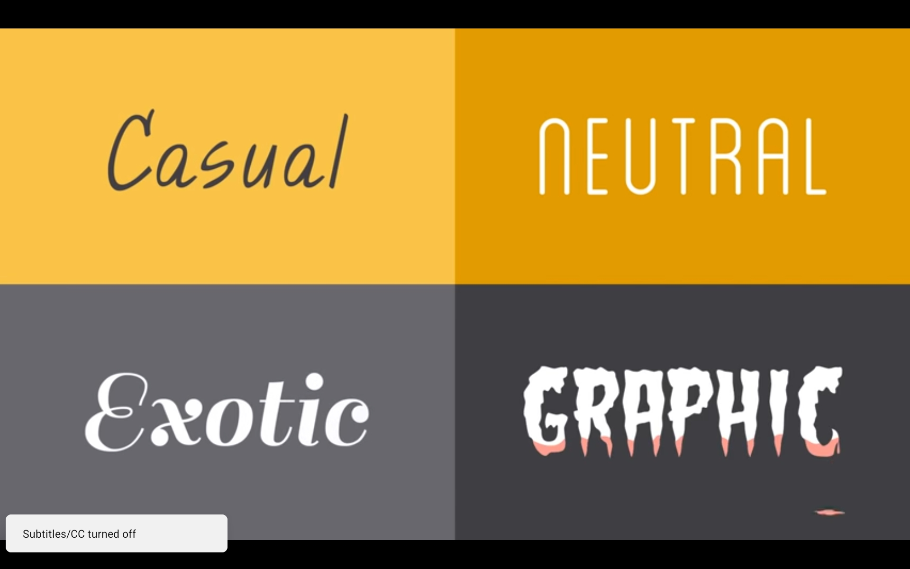
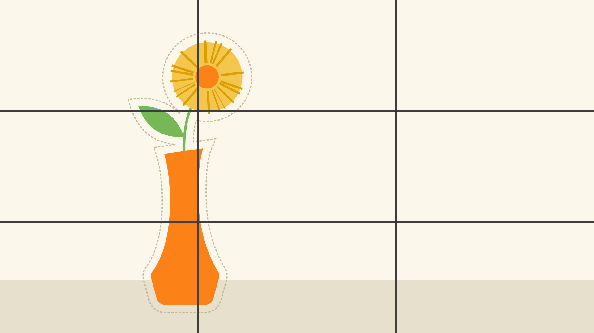
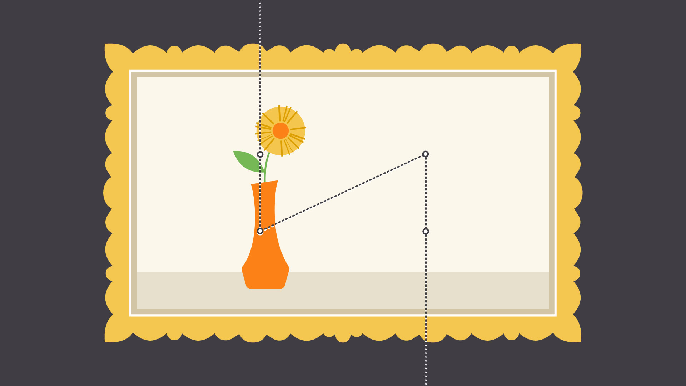

# Intro to Graphic Design

from **[GCF Global](https://edu.gcfglobal.org/en/beginning-graphic-design/)**

## Typography [^1]

Typography is the style or appearance of text.

**Some Common Types of Fonts**

- Serif
	- Classic Look
	- Use for: Traditional Projects like Print Publications (magazine, newspaper)
- Sans Serif
	- Clean & Modern
	- Use for: Computer Screen, tablets or smartphones
- Display
	- Decorative nature
	- Use for: small amount of text like in title, headers or more graphic heavy designs
	- Check Fonts like: Script, Blackletter, ALL CAPS, Plain fancy

> [!tip] When deciding which font to use for a project - **Less is more**

- It is best to limit yourself to one or two fonts per project.
- If you need more contrast, try repeating one of your fonts in different size, weight or style.
- Opposite Attracts is also true for font / Different but complementary
	- For examples: San Serif with Serif, Short with Tall, Decorative with Simple

### Typography Terms

1. Hierarchy
	- Used to guide the reader's eye to whatever is most important (using different level of emphasis)
2. Leading
	- space between lines of text (aka: Line Spacing)
3. Tracking
	- Character spacing
4. Kerning
	- Space between specific characters

## Color / Color Theory [^2]

The Basics: The mix of primary and secondary colors make a color wheel

Primary Colors: Red, Blue, Yellow
Secondary Colors: Orange, Green, Purple

### Color Terms

1. Hue
	- Just another words for **"Color"**
2. Saturation
	- Refers to Intensity (which appears subtle or Vibrant)
3. Value
	- How dark or light the color is from Black to White
4. Tones
	- Lighter
	- Darker
	- Desaturated

> [!tip] How to choose a correct color for your project! Use **Color Harmony**

### Color Harmony

Color Harmony is a tried and true formula which applied in color wheel

#### Color Harmony Formulas

1. Monochromatic
	- It use one color (or) Hue
	- With different level of saturations or values
2. Analogous
	- Uses colors that are next to each other on the wheel
3. Complementary
	- Are opposite each other
4. Split Complementary
	- Uses the color on either side of the compliment
5. Triadic
	- Uses three color that are evenly spaced, forming a perfect triangle △
6. Tetradic
	- Form a rectangle ▭ on the wheel (using not one but two complementary color pairs)
	- This formula works best if you let one color dominate while the others serve as an accent

### Color Theory - Dos & Don'ts

- Don't use Vibrate colors
	- The Solution is start with one color and try adjusting it lightness, darkness or saturation
- Readability
	- Color shout be legible, engaging & easy on the eyes

### Color Theory Tips

- Every Color sends a message
	- Bright colors - Tends to have a fun or modern vibe
	- Desaturated Color - Often appear more business-like
- Find ideas from all kind of places
	- Example - Advertising, Branding, Famous work of art

## Layout & Composition [^3]

- Layout & Composition are foundation of Design
- To master Layout & Composition - **Think like a designer**

### Five Basic Principles

1. Proximity
	- Use visual space to show relationship in your content
	- Make sure that related items grouped together
	- Non related items to be separated
2. White space
	- It's an important part of every composition
	- It also means negative spaces between image, lines and so on
3. Alignment
	- The important thing is to be consistent
	- Make a "Grid" and arrange your content
4. Contrast (also closely tied to [[Graphic-Design#Typography Terms|Hierarchy]])
	- Simply means that one item is different from another
	- Catch the reader's eye, create emphasis or call attention to something important
	- Some Strategies to create contrast
		- You can use color
		- Adjust size, shape or visual weight of an object
		- Use contrasting styles of text
5. Repetition
	- Every project should have a consistent look and feel
	- Repeating or echoing certain elements

## Images [^4]

- Images are more than just decoration
- It's a hook that draws the viewer in

**Tips**

- Find _High-Quality images_ for any type of project
	- Sharp
	- Clear
	- No distortion
- Cosmetic adjustment let you enhance certain image quality
	- Like Brightness
	- Contrast
	- Saturation
	- Color

Better watch the actual video - [Beginning Graphic Design: Images](https://youtu.be/MELKuexR3sQ?si=P234Y1QPmBRNPb-o)

## Fundamental of Design [^5]

- It is a basis of every digital medium

### Elements of Design

1. Line
	- It can be Fat, Thin, Wavy, Jagged
	- It used as emphasis, or divide, or organize content, or even guide the viewer's eye
	- Pay attention to things like **Weight**, Color, Texture, Style
2. Shape
	- Shape is any Two Dimensional area with recognizable boundary
	- It falls into 2 different categories
		- Geometric / Regular
		- Organic / Free form
	- It's a vital part of communication ideas visually
	- It can help us to organize, or Separate content, or Create simple illustrations
3. Form
	- When shape become a 3D we call it a Form
	- It can be exist in real world / It can be create using techniques like light, shadow & Perspective to create the illustration depth
4. Texture
	- It is a physical quality of a surface
	- In design it adds depth and Tactility
5. Balance
	- It is a equal distribution of visual weight
	- It can be effected by many things including Color, Size, Number or Negative Space

**Tips**

- **Rule of Thirds** - Many people use this strategy, it divide the work area into a 3x3 Grid

- Better watch the YouTube video [Beginning Graphic Design: Fundamentals of Design]([Beginning Graphic Design: Fundamentals - YouTube](https://www.youtube.com/watch?v=YqQx75OPRa0))

[^1]: [Beginning Graphic Design: Typography](https://edu.gcfglobal.org/en/beginning-graphic-design/typography/1/)
[^2]: [Beginning Graphic Design: Color](https://edu.gcfglobal.org/en/beginning-graphic-design/color/1/)
[^3]: [Beginning Graphic Design: Layout and Composition](https://edu.gcfglobal.org/en/beginning-graphic-design/layout-and-composition/1/)
[^4]: [Beginning Graphic Design: Images](https://edu.gcfglobal.org/en/beginning-graphic-design/images/1/)
[^5]: [Beginning Graphic Design: Fundamentals of Design](https://edu.gcfglobal.org/en/beginning-graphic-design/fundamentals-of-design/1/)